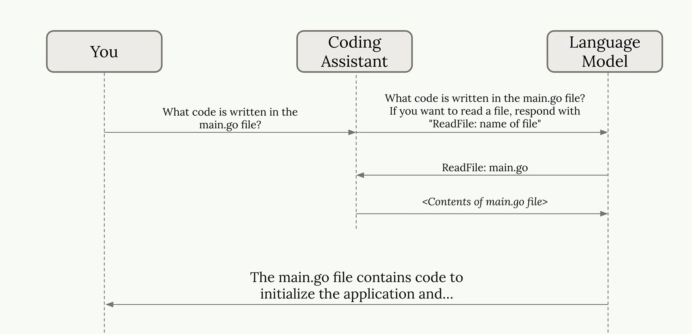
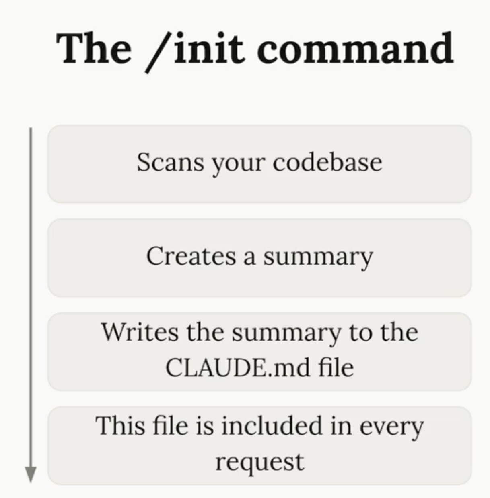

### [Claude code in action](https://anthropic.skilljar.com/claude-code-in-action)

Claude code a coding assistant: is essentially a sophisticated **API client** that orchestrates the conversation between **you, the LLM, and your codebase**.

The "magic" is that Claude Code sets up the LLM with the right system **prompts, tools, and workspace context** so Claude can autonomously navigate your codebase, make edits, run tests, and iterate - all while having a conversation with you about what it's doing.

📔 To see all the tool names to which Claude has access, just ask: `List out the names of all the tools you have access to, bullet point list`

When starting in a new codebase run `/init` command. This tells Claude to analyze your entire codebase and understand: the project's purpose and architecture, coding patterns, and structure.

Claude's scopes aka memory layers, Claude reads them at the start of **every session**, [MRO for Claude md files](https://code.claude.com/docs/en/memory#how-claude-md-files-load):

    CLAUDE.md or .claude/CLAUDE.md - Generated with /init, committed to source control, in the root of the project, shared with other engineers.

    CLAUDE.local.md - Lives next to your project's CLAUDE.md in the repo root Git-ignored (auto-added to .gitignore), so it never gets committed. Use it for things only relevant to you on that project: your local dev URLs, personal sandbox credentials, preferred test data, debugging shortcuts, or workflow quirks your teammates don't need.

    ~/.claude/CLAUDE.md - (global, personal) Used with all projects on your machine, it contains instructions that you want Claude to follow on all projects. Communication preferences (e.g. "be concise, skip pleasantries")

In a typical solo project you'd have 2 files loaded upfront (global + project root).

📔  Before you type anything: `CLAUDE.md, auto memory, MCP tool names, and skill descriptions` all load into context.

* [Exploring the context window](https://code.claude.com/docs/en/context-window) .A bloated `CLAUDE.md` is DEAD WEIGHT ON EVERY SESSION. The general recommendation is to `keep it under 200 lines`. For anything that doesn't apply to every request, you can use Skills or reference files instead — those only get loaded when needed, saving tokens.

Run `/memory` inside your Claude Code session. It shows you which memory files are currently loaded, lets you edit them directly, and reloads the context when you save. Agent Factory

Run run `/context` to see a full breakdown of what's consuming your context window, which will include the `CLAUDE.md` content.
